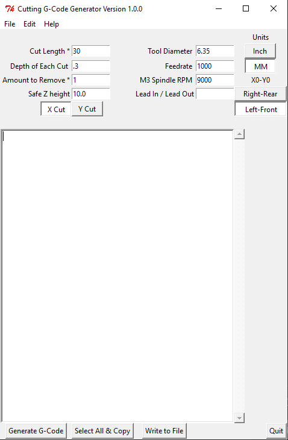

Line Cutting Software
=====================

**Author:** Andrew Fernie starting from face.py by John Thornton

**Download:** [line-cut.py]

The line cut software cuts a slot of a defined length, depth, and orientation (along X or Y axes). Slot width is the width of the tool. 

Assumes that the top of the material is Z0 and nothing is above Z0.

Features
--------

Screenshot
-----------

