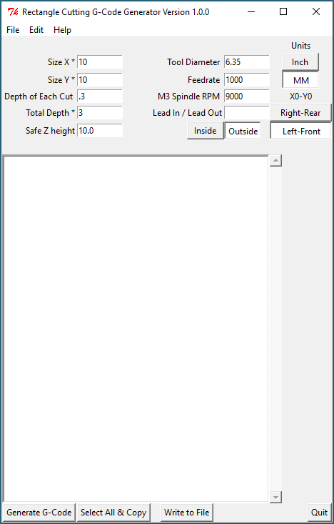

Rectangle Cutting Software
==========================

**Author:** Andrew Fernie staring from face.py by John Thornton

**Download:** [rectangle.py]

The rectangle cutting software generates the gcode to cut a path inside or outside a rectangle of a given size. Of course, interior corners are limited by the tool diameter. You input a few things and press a button and your code is saved and ready to be processed by your favorite gcode sender.

Assumes that the top of the material is Z0 and nothing is above Z0.

Features
--------

Screenshot
-----------

